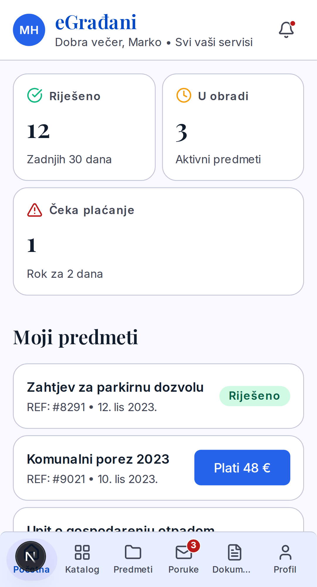
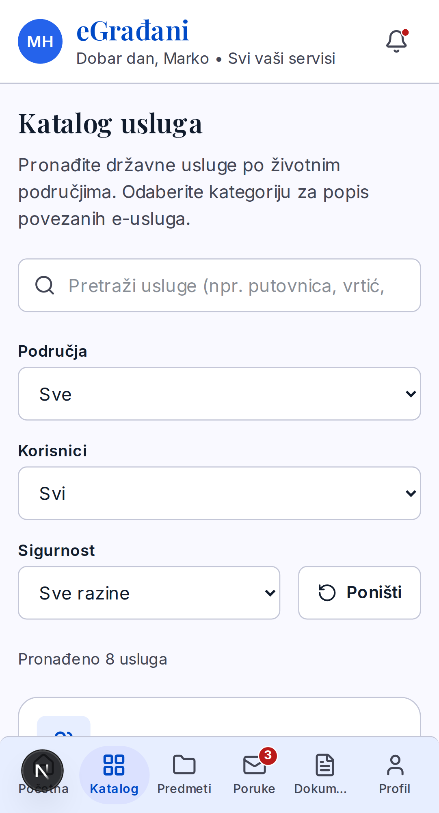
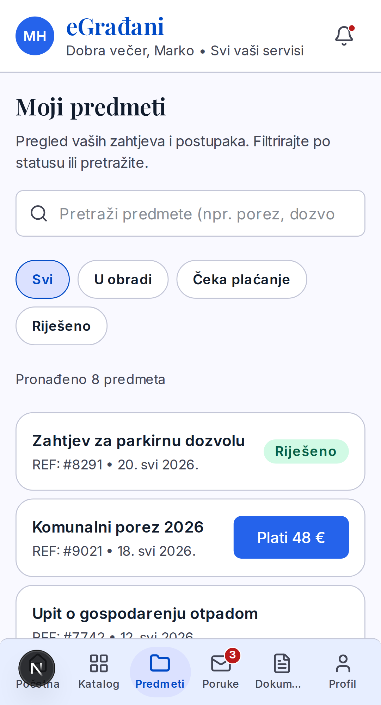
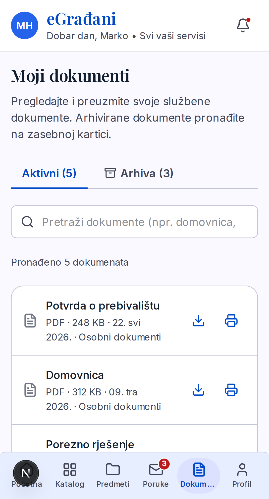
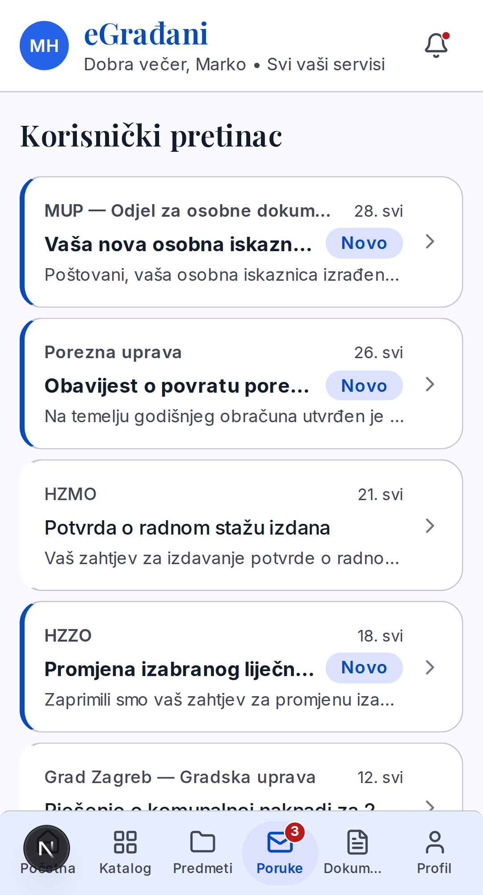
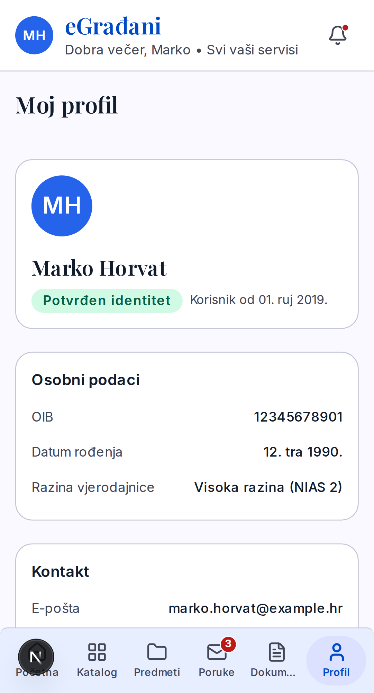

# eGrađani — redizajn državnog portala (koncept)

[](https://github.com/karloturk333-hash/egradanimock/actions/workflows/e2e.yml)

> Moderan, **pristupačan** (WCAG AA) i **mobile-first** redizajn korisničkog portala. Portfolio koncept: **Next.js App Router**, dizajn-sistem na tokenima, te **Playwright e2e** na 3 ekrana.

<p align="center"></p>

## 📱 Mobilni prikaz

<table>
<tr>
<td></td>
<td></td>
<td></td>
</tr>
<tr>
<td align="center"><sub>Početna</sub></td>
<td align="center"><sub>Katalog</sub></td>
<td align="center"><sub>Predmeti</sub></td>
</tr>
<tr>
<td></td>
<td></td>
<td></td>
</tr>
<tr>
<td align="center"><sub>Dokumenti</sub></td>
<td align="center"><sub>Poruke</sub></td>
<td align="center"><sub>Profil</sub></td>
</tr>
</table>

## ✨ Što je implementirano

- **Dashboard** (`/`) — statusne kartice (Riješeno / U obradi / Čeka plaćanje), predmeti, dokumenti. Mobitel: **2-stupčani grid** (bez horizontalnog scrolla); desktop: sidebar.
- **Katalog usluga** (`/katalog`) — pretraga + 3 filtera, responzivni grid kartica, detalj `/katalog/[slug]` (pravi **404** za nepoznat slug).
- **Predmeti** (`/predmeti`) — popis svih predmeta građanina, **pretraga** + **filter po statusu** (U obradi / Čeka plaćanje / Riješeno).
- **Korisnički pretinac** (`/poruke`) — inbox, detalj poruke, **badge nepročitanih** u navigaciji, responzivni split na desktopu.
- **Dokumenti** (`/dokumenti`) — **ARIA tablist** Aktivni / Arhiva, pretraga, po dokumentu **Preuzmi** + **Ispiši**, klik → pregled `/dokumenti/[slug]` s ugrađenim **pravim PDF-om**.
- **Profil** (`/profil`) — osobni podaci, kontakt, status vjerodajnice (NIAS), te pristupačni **toggle switchevi** (`role="switch"`) za postavke obavijesti.

## ♿ Pristupačnost (glavni naglasak — državni portal)

- Pravi **ARIA tablist** (tipkovnica: ←/→, `aria-selected`, `role="tabpanel"`)
- Sve ikon-kontrole imaju `aria-label`; `aria-live` najave broja rezultata; `role="alert"` za greške; `aria-busy` za loading
- **Dodirne mete ≥ 44px**, vidljiv fokus (`:focus-visible`), **skip link**
- Status **ne samo bojom** (tekstualni „Novo" / „Arhivirano" badge); WCAG **AA** kontrast kroz tokene
- Semantika: **link = navigacija, button = akcija**

## 🔄 Tri stanja podataka (pravilo projekta)

Svaki dohvat ima **loading / error / uspjeh** (+ **prazno**) — nikad prazan ekran. `loading.tsx` skeleton, `error.tsx` boundary + „Pokušaj ponovo".

## 🧱 Tech stack

**Next.js 16** (App Router, React Server Components) · **TypeScript** · **Tailwind v4** + CSS tokeni · Inter + Playfair Display · Lucide ikone · **Playwright** (e2e)

## 🧪 Testiranje

Playwright e2e na **desktop / tablet / mobile**, s **test-seamovima** (env varijable koje tjeraju app u prazno / error / sporo stanje). Pokriva render, pretragu i filtere, prebacivanje tabova, sva stanja podataka, i **404** za nevažeće rute. (`/dokumenti` suite: **45/45**.)

```bash
npm run test:e2e:docker   # Playwright u Docker imageu (WSL)
```

## 🚀 Pokretanje

```bash
npm install
npm run dev               # na WSL-u: next dev --webpack
```

Otvori **http://localhost:3000**.

## 🏗️ Arhitektura (Next.js App Router)

```
Server komponenta  ──await getX()──▶  mock data sloj (+ test seamovi)
       │ props (serijalizabilni)
       ▼
Client komponenta ("use client")  ──▶  interaktivnost (pretraga, tabovi, filteri)
```

Folderi = rute. `generateStaticParams` + `dynamicParams = false` → unaprijed izrađene stranice (SSG) + **pravi 404** za nepoznate.

---

<sub>Portfolio koncept. Sav sadržaj je mock i nije povezan s pravim eGrađani sustavom. Sljedeće: animacije prijelaza između ruta i širenje e2e pokrivenosti na sve stranice.</sub>
